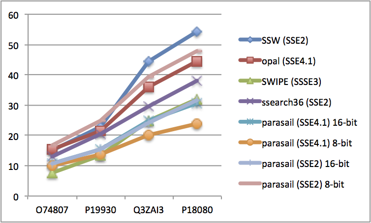
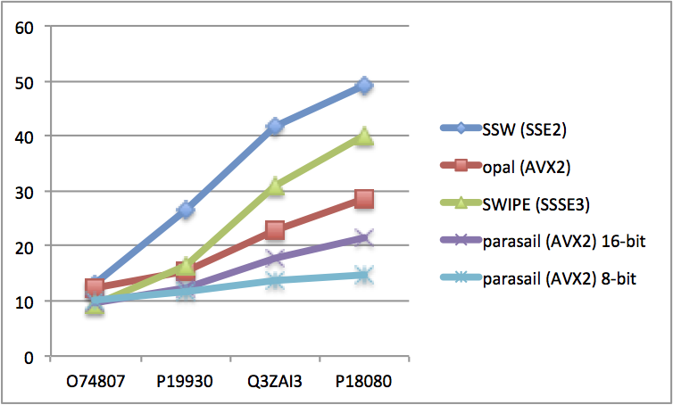

## Comparison with other aligners

**Special thanks to Martin Šošić for the original version of this
document in the OpAl software package. See
https://github.com/Martinsos/opal/blob/master/aligner_comparison.md for
the original. **

The following presents results of speed comparisons of parasail with
other aligners: SSW, ssearch (FASTA), OpAl, and SWIPE.  Since SSW and
SWIPE only do Smith-Waterman alignment, we compared all software only
for SW.

Aligners were tested by quering sequences against UniProtKB/Swiss-Prot
database (containing 547964 sequences).  The database can be obtained
from www.uniprot.org/downloads -> UniProtKB/Swiss-Prot.  

Specific sequences can also be obtained from www.uniprot.org by
searching for them by name (Search tab).

All aligners were tested with following parameters:
* number of threads = 1
* gap opening = 3
* gap extension = 1
* score matrix = BLOSUM50

Only scores were calculated (not alignments). Time spent to read query
and database sequences was not measured. In the case of SSW, output was
programmatically suppressed to avoid its effect on alignment timing.

Links to the software used:
* SSW: https://github.com/mengyao/Complete-Striped-Smith-Waterman-Library
* OpAl: https://github.com/Martinsos/opal
* SWIPE: https://github.com/torognes/swipe
* ssearch: http://faculty.virginia.edu/wrpearson/fasta/fasta36/fasta-36.3.7b.tar.gz

How aligners were called:
* SSW: `./ssw_test -p uniprot_sprot.fasta <query_file>`
* OpAl: `./opal_aligner -s <query_file> uniprot_sprot.fasta`
* SWIPE: `./swipe -a 1 -p 1 -G 3 -E 1 -M BLOSUM50 -b 0 -i <query_file> -d uniprot_sprot`
  * NOTE: database had to be preprocessed for SWIPE using _makeblastdb_
* ssearch: `./ssearch36 -d 0 -T 1 -p -f -3 -g -1 -s BL50 <query_file> uniprot_sprot.fasta`
* parasail: `parasail_aligner -x -t 1 -a <function> -o 3 -e 1 -m blosum50 -f uniprot_sprot -q <query_file>`
  * SSE4.1, 16-bit: -a sw_striped_profile_sse41_128_16
  * SSE4.1, 8-bit: -a sw_striped_profile_sse41_128_8
  * SSE4.1, 8-bit with saturation check: -a sw_striped_profile_sse41_128_sat
  * AVX2, 16-bit: -a sw_striped_profile_avx2_256_16
  * AVX2, 8-bit: -a sw_striped_profile_avx2_256_8
  * AVX2, 8-bit with saturation check: -a sw_striped_profile_avx2_256_sat

The following tables show how much time it took for different sequences to be
aligned against the UniProtKB/Swiss-Prot database. All times are in seconds. The times are an average of three runs.

The following tests were performed on a MacBook Pro i5 CPU @ 2.53GHz with 8GB
RAM (SSE4.1 support). The compiler was Apple LLVM version 6.0 (clang-600.0.57.

|                                |O74807  |P19930  |Q3ZAI3  |P18080|
|--------------------------------|--------|--------|--------|------|
|query length                    |110     |195     |390     |513   |
|SSW (SSE2) 16-bit only          |13.9    |19.4    |29.9    |39.7  |
|SSW (SSE2) saturation           |14.9    |22.7    |44.4    |54.4  |
|opal (SSE4.1)                   |15.2    |21.5    |35.9    |44.6  |
|SWIPE (SSSE3)                   |7.6     |13.3    |24.7    |32.0  |
|ssearch36 (SSE2)                |12.9    |20.4    |29.6    |38.1  |
|parasail (SSE4.1) 16-bit        |10.7    |15.2    |24.8    |30.5  |
|parasail (SSE4.1) 8-bit\*       |9.9     |13.7    |20.0    |23.7  |
|parasail (SSE4.1) saturation\*\*|10.3    |25.9    |43.1    |52.2  |

\* The 8-bit integer range is often not sufficient for large scores and will overflow, so these timings should be used as a lower bound; no overflow detection was applied and accounted for.

\*\* The parasail saturation-checking functions are slow when the alignment score is expected to overflow the smaller 8-bit integer range.  As the query length increases, the performance basically becomes the sum of the 8-bit and 16-bit implementations because the 8-bit function will always overflow, causing both functions to execute.  This is wasteful computation.  It is more beneficial in general to use the appropriate bit-width if the score is expected to overflow the 8-bit score.

The following tests were performed on an Intel Haswell E5-2670 v3 CPU running
at 2.3 Ghz with 64 GB 2133 Mhz DDR4 memory. The compiler used was Intel ICC
15.0.1 using level three optimization (-O3).

|                                        |O74807  |P19930  |Q3ZAI3  |P18080|
|----------------------------------------|--------|--------|--------|------|
| **query length**                       |110     |195     |390     |513   |
| **SSW(SSE2)**                          |13.1    |26.3    |41.8    |49.0  |
| **ssearch36(SSE2)**                    |11.7    |21.1    |30.6    |37.1  |
| **OpAl(SSE4.1)**                       |17.8    |24.2    |38.9    |48.1  |
| **OpAl(AVX2)**                         |12.2    |15.4    |22.8    |28.4  |
| **SWIPE(SSSE3)**                       |9.3     |16.4    |30.8    |39.9  |
| **_parasail(SSE4.1) 16-bit_**          |11.0    |15.7    |27.3    |34.5  |
| **_parasail(SSE4.1) 8-bit_**\*\*       |9.0     |12.6    |19.0    |23.4  |
| **_parasail(AVX2) 16-bit_**            |9.5     |12.2    |17.6    |21.6  |
| **_parasail(AVX2) 8-bit_**\*\*         |10.1    |11.8    |13.5    |14.7  |
| **_parasail(AVX2) satcheck_**\*\*\*    |10.1    |21.2    |30.1    |34.7  |

\*\*  See above.

\*\*\* See above.

